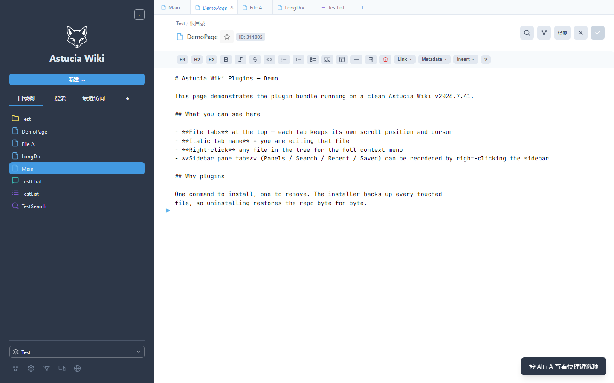
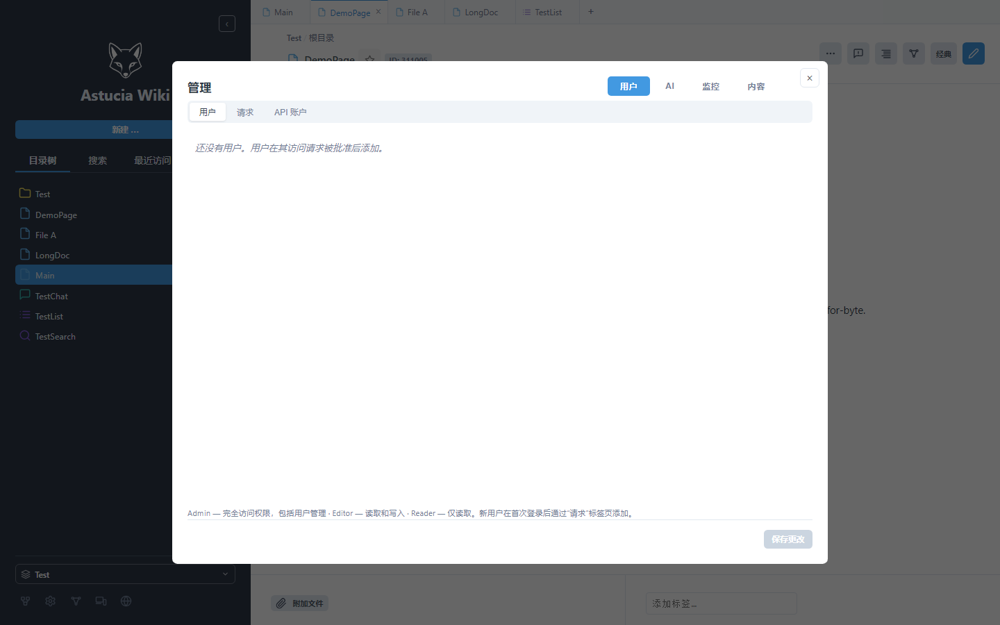
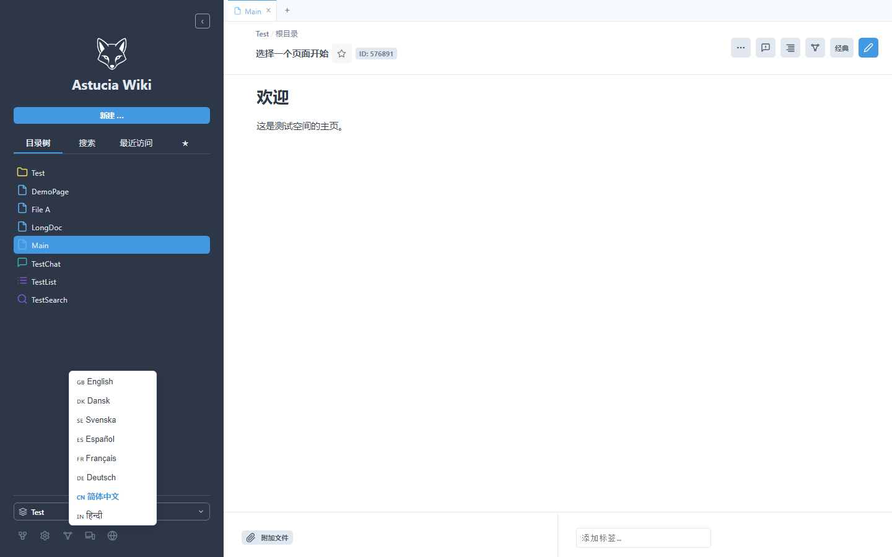
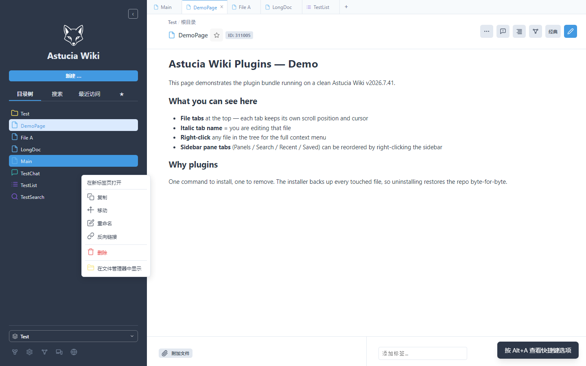

# Astucia Wiki Plugins — 一键安装插件包

为 [Astucia Wiki](https://github.com/madsrg/astucia-wiki) 增加一组文件管理能力，
**任何下载了 Astucia Wiki 源码的人都能直接安装**。

> 📖 **English version**: see [README.md](README.md)

```
插件包 (本目录)
   │  bash installer/install.sh <wiki根目录>
   ▼
你的 Astucia Wiki 项目根目录
```

## 这个包装了什么（最终效果）

| 插件 | 功能 |
|---|---|
| **Tabs** | 浏览器式文件标签页：每个标签独立保存滚动位置 / 光标 / 未保存编辑；单击打开为可替换的"预览"标签、右键"在新标签页打开"为永久标签；标签可拖拽排序、右键关闭；斜体 = 正在编辑 |
| **Tree Drag & Move** | 文件树多选（Ctrl/Shift）+ 拖拽移动（根目录是合法落点）+ 完整右键菜单（打开/新标签页/复制/移动/重命名/Backlinks/删除/在文件管理器中显示） |
| **Sidebar Tab Order** | 侧边栏（页面/标签/最近/收藏）右键进入编辑模式：拖拽排序、隐藏/恢复面板，跨设备同步 |
| **Context Menu** | 共享右键菜单组件（上述插件的底座，无独立界面） |

附带的基础修复：文件树刷新不再收起已展开的目录；Tab 编辑状态跨标签切换完整恢复；
管理员可删除 Space、在文件管理器中显示文件（Windows/macOS/Linux）。



**8 语言全量本地化**：en/zh/hi/da/sv/es/fr/de 共 **7800+ key**（zh 994、hi 1001、de 781…）。
侧边栏 / 搜索 / TOC / 面板标题 / 编辑 / 历史 / 管理 / 偏好设置 / 各弹窗 等 UI 字符串切换语言即时生效。
覆盖方式：
- `index.php` 全量整体替换（**309 处 data-i18n**，含侧边栏 pane-tab"最近访问/目录树/搜索"、
  admin 分组"用户/AI/监控/内容"、各 modal 标题等——此前这些是遗漏点）
- 43 个模块级 i18n 改动（admin/chat/list/toc/...）以 Tier 2 整体替换方式打包



**操作日志审计**：复用项目自带的 `write_access_log`，在 11 类关键动作的成功分支
插入审计调用：FILE_UPDATE / FILE_CREATE / FILE_DELETE / FOLDER_CREATE / FOLDER_DELETE /
FILE_MOVE / FILE_RENAME / FOLDER_MOVE / FOLDER_RENAME / FILESFOLDER_CREATE /
SPACE_CREATE / SPACE_RENAME / SPACE_DELETE / FILE_REVEAL。日志格式
`时间 | 事件 | uid | name | IP | 详情`，写入 `LOG_DIR/yyyy-mm-dd_access.log`。



> **实测验证**（v2026.7.41 干净安装，PHP 内置服务器 127.0.0.1:8478，浏览器 + curl）：
> 80 patches / 0 needs-manual，`php -l` 4 个核心文件全过；
> 语言切换实测 en / zh / de：搜索框（Search pages… / 搜索页面… / Seiten suchen…）、
> TOC 面板（Contents / 目录 / Inhalt）全部正确翻译；
> 11 类审计事件全部触发并写入日志，零页面错误。


> 语言切换实测 en / zh / de：搜索框（Search pages… / 搜索页面… / Seiten suchen…）、
> TOC 面板（Contents / 目录 / Inhalt）全部正确翻译；
> 11 类审计事件全部触发并写入日志，零页面错误。

## 环境要求

- Astucia Wiki **v2026.7.40 / v2026.7.41 实测通过**（安装脚本用"锚点"定位，
  上游小改动仍能装，差异明显时会明确提示手动处理）
- PHP 8.0+（与 Wiki 本身一致）

## 安装（3 步）

```bash
# 1. 把本目录解压到任意位置（不要求放在 wiki 内）
# 2. 运行安装脚本，参数是你的 wiki 根目录
bash installer/install.sh /var/www/astucia-wiki
# Windows (Git Bash):  bash installer/install.sh "E:/sites/astucia-wiki"

# 3. 清空浏览器缓存（Ctrl+Shift+R），刷新页面
```

脚本做的事：
1. 在 wiki 根目录创建 `plugins-backup/` 备份所有将被修改的文件（**固定目录**，
   首次安装创建，重复安装不会覆盖，保证卸载总能还原安装前的原始文件）
2. 复制 4 个插件到 `wiki/plugins/`
3. 整体替换 `core/replace/` 里的 44 个文件（index.php + 43 个模块，含插件配套 +
   R10 全量本地化 + bug 修复）
4. 对 6 个核心文件按锚点打 34 个补丁（自动定位、自动跳过已装内容，可反复运行）

**输出含义**：`applied` = 已打补丁或已复制；`skipped` = 已安装过（幂等）；
`needs-manual` = 锚点未找到（上游版本差异），见下方"手动安装"。

## 手动安装（脚本提示 needs-manual 时）

每个补丁块都带 `=== local plugins ===` 标记。手动安装 = 把
`core/blocks/<文件名>.code` 的内容，放到 `core/install.index` 中对应行
指定的锚点位置（`anchor` 列），并确保该行在 wiki 源码中存在。
`core/install.index` 有完整说明。脚本已自动跳过已装块，手动补完再跑一次即可。

## 卸载

```bash
bash installer/uninstall.sh /var/www/astucia-wiki
```

从备份目录恢复全部被改文件并删除插件目录。

## 目录结构

```
astucia-wiki-plugins/
├── README.md                ← English version（主 README）
├── README.zh.md             ← 本文件（中文版）
├── plugins/                 # 4 个插件本体（完整、自包含）
│   ├── context_menu/
│   ├── sidebar_tab_order/
│   ├── tabs/
│   └── tree_drag_move/
├── core/
│   ├── install.index        # 打补丁清单（文件/锚点/幂等标记）
│   ├── blocks/              # 每个补丁的代码块（带 === local plugins === 标记的代码）
│   └── replace/             # 整体替换的文件（44 个：index.php + 43 模块，插件接线 + R10 全量 i18n + bug 修复）
├── installer/
│   ├── install.sh           # 安装（备份+复制+打补丁，幂等）
│   └── uninstall.sh         # 卸载（从备份恢复）
└── screenshots/             # 实测截图（中文 UI 展示本地化）
    ├── tabs-multi.png        # 多标签页：一个编辑中（斜体+圆点），其余预览
    ├── ctx-menu.png          # 文件右键菜单
    ├── i18n-zh.png           # 全中文 UI（侧边栏/按钮/底部全部翻译）
    ├── i18n-admin.png        # Admin 面板：分组标签中文
    └── lang-dropdown.png     # 语言下拉：8 种语言
```

## 兼容性与设计说明

- **为什么用"锚点"而不是 diff**：锚点 = 源码中稳定的原始行，上游小改动不影响
  安装；找不到锚点时脚本明确报错，绝不装错位置。
- **Tier 2 整体替换的文件**（`core/replace/`，44 个）：同时包含插件接线、
  R10 全量 i18n 模块改动（admin/chat/list/toc/... 与 index.php 的 309 处 data-i18n）和少量
  bug 修复——这些改动与上游 .41 的差异 100% 是 i18n 字符串（已验证：每个文件与 .41 的
  diff 中无非 i18n 行），故提供完整文件（基于 v2026.7.40）不会丢失上游功能。
  如果 wiki 之后升级上游，重新执行 `install.sh` 即可（备份目录固定，会重新备份最新上游）。
- **移除插件**：卸载脚本 + 源码中所有 `=== local plugins ===` 标记块可整体
  删除，详见每个插件头部注释。

## 验证安装

装完后在 wiki 里：
1. 文件树单击任意文件 → 顶部出现标签页（预览标签，名称正常非斜体）
2. 点击编辑按钮 → 当前标签名变斜体；输入内容 → 出现圆点（未保存）
3. 切到另一个文件再切回 → 编辑内容 / 光标 / 滚动位置保持
4. 右键文件 → 菜单含"在新标签页打开 / 复制 / 移动 / 重命名 / Backlinks / 删除 / 在文件管理器中显示"
5. 右键标签栏空白处 → 可编辑侧边栏标签顺序
6. 切换顶部语言下拉 → 侧边栏标签（目录树/搜索/最近访问）、搜索框、TOC 标题、
   管理员面板分组（用户/AI/监控/内容）等全部即时翻译
7. 任何写操作后 → `LOG_DIR/yyyy-mm-dd_access.log` 出现对应事件行

如果 2–3 步异常，多半是浏览器缓存，强制刷新后重试。


